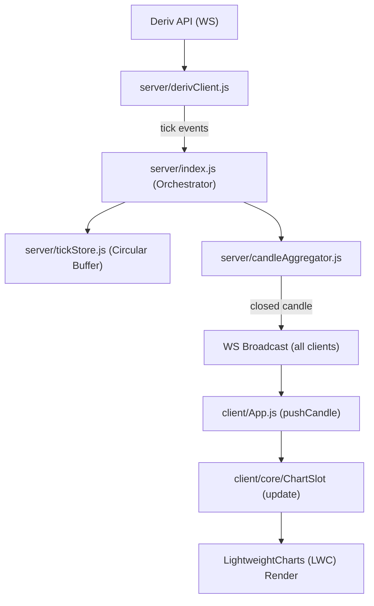

# Micro-Structure X-Ray: Architecture & Data Flow

## 1. System Philosophy

This is a low-latency, "direct-to-metal" trading visualization system. It avoids heavy frameworks, complex state management, and unnecessary abstractions in favor of raw performance and immediate feedback.

---

## 2. Core Data Flow (The Pulse)

---

## 3. Key Architectural Rules

### 1. The 1000/3600 Rule

Client-side `candleBuf` is capped at **1000** bars. `tickBuf` is capped at **3600** points. Exceeding these causes immediate performance degradation in LWC v5 coordinate calculations.

### 2. No Framework-Lock (LWC v5)

We use vanilla JS for chart lifecycle management. `ChartSlot` is the primary unit of chart state.

### 3. Server-Aggregated Candles

Clients **never** aggregate candles from ticks. The server is the single source of truth for candle OHLC and boundaries. This ensures consistency across multiple open tabs.

### 4. Grid Panel Rebuild Pattern

Switching timeframes on a grid panel **destroys and recreates** the series (via `rebuildGridPanel()`). Attempting to "live-update" a series type change causes memory leaks in the current LWC plugin configuration.

### 5. Canvas Overlay Layer

Trade markers, barriers, and liquidity zones use the **Canvas 2D API** layered over the LWC chart. This bypasses LWC's primitive rendering limits and allows for finite line segments and complex fills.

### 6. SQLite Persistence

While the system is "in-memory-first," `probabilityEngine.js` flushes results to a local SQLite database for cross-session regression testing and GBM (Geometric Brownian Motion) calibration.

### 7. No framework, no store, no DI container

State lives at module scope. `tickBuf` and `candleBuf` are plain arrays/objects in `App.js`. `DrawingManager` uses a module-level singleton `Set` for its shared RAF loop. This is intentional — the app is small enough that a framework would add overhead without benefit.

---

## Server Components

| File                     | Purpose                                                      | Stateful?               | EventEmitter?                                 |
| :----------------------- | :----------------------------------------------------------- | :---------------------- | :-------------------------------------------- |
| `index.js`               | Orchestrator, WS server, tick pipeline                       | Yes                     | Listener                                      |
| `derivClient.js`         | Deriv API WebSocket client with reconnection                 | Yes                     | Yes (tick, authorize, proposal_open_contract) |
| `tradingEngine.js`       | Proposal/buy/settlement lifecycle                            | Yes                     | Yes (trade_outcome, contract_update)          |
| `tickStore.js`           | Circular buffer (Float64Array, 30k max)                      | Yes                     | No                                            |
| `candleAggregator.js`    | Tick→candle conversion, gap-fill                             | Stateless functions     | No                                            |
| `volatilityEngine.js`    | Rolling vol, vol ratio, trend detection                      | Yes                     | No                                            |
| `probabilityEngine.js`   | GBM + empirical touch probability                            | Yes (SQLite)            | No                                            |
| `edgeCalculator.js`      | Edge = our prob - implied prob                               | No (reads volEngine)    | No                                            |
| `microStructure.js`      | Velocity, acceleration, compression                          | No (reads tickStore)    | No                                            |
| `reachGridEngine.js`     | Barrier reach rate matrix                                    | Stateless pure function | No                                            |
| `config.js`              | All constants, API keys, thresholds                          | No                      | No                                            |

## Client Components

| File                            | Purpose                                                                                  |
| :------------------------------ | :--------------------------------------------------------------------------------------- |
| `core/App.js`                   | Root module. ChartSlot class, buffers, tab switching, barrier system, WS message routing |
| `utils/ChartHelpers.js`         | DOM shortcuts, theme, candle config, coordinate math                                     |
| `drawing/DrawingManager.js`     | User annotations with shared RAF loop                                                    |
| `overlays/TimeBlockOverlay.js`  | Time block boundary visualization                                                        |
| `overlays/LiquidityEqOverlay.js`| Liquidity levels and equilibrium zones                                                   |
| `overlays/TradeOverlay.js`      | Trade entry/exit/barrier visualization                                                   |
| `trading/TradingPanel.js`       | Self-contained trade UI, single-click flow                                               |
| `engines/SimpleMetricsEngine.js`| Efficiency, flip-rate, texture regime detection                                          |

---

## Known Gotchas

1. **LWC throws on unsorted/duplicate timestamps.** All data passed to `series.setData()` must be sorted ascending with unique `time` values. The `sanitizeCandleBar()` and `sanitizeTickPoint()` functions plus dedup logic in `ChartSlot.setData()` handle this.
2. **LWC v5 API differences.** Series are created with `chart.addSeries(LightweightCharts.CandlestickSeries, opts)` not `chart.addCandlestickSeries(opts)`. Markers use `createSeriesMarkers()` plugin.
3. **Deriv tick epochs can arrive out of order or duplicated.** `TickStore` rejects these with diagnostic logging. The `candleAggregator` handles gaps by filling flat candles.
4. **Grid panels vs normal tabs use different init patterns.** Grid panels use `rebuildGridPanel()` which destroys and recreates the series (needed for TF switching between line/candle types). Normal tabs use `ChartSlot.init()` which is one-time.
5. **Browser cache busting.** CSS and JS files use `?v=N` query params in `index.html`. Bump these after changes or the browser will serve stale files.
6. **Demo account token is hardcoded.** Token `dFRmBOxtictbZ7L` is in `config.js`. This is intentional — single-user demo account, no auth needed.
7. **The `isSwitching` lock on grid panels must be cleared synchronously.** Using `requestAnimationFrame` to clear it creates a window where incoming candles are silently dropped.

---

## Test Approach

- **Framework:** Jest (CommonJS, `npm test`)
- **Style:** Behavior-focused, concrete inputs/outputs, no mocking of our own code
- **Reference test:** `server/candleAggregator.test.js` — follow this pattern
- **Regression tests:** Every bug fix gets a test that would have caught it
- **Test locations:** `tests/` directory for integration tests, co-located `*.test.js` for unit tests

### Current test suites

| Suite                             | Tests | What it covers                                              |
| :-------------------------------- | :---- | :---------------------------------------------------------- |
| `tests/core_logic.test.js`        | 7     | VIEW/LIVE anchor logic, buffer hygiene, tick dedup/ordering |
| `server/candleAggregator.test.js` | 5     | Candle construction, boundary handling, gap-fill            |
| `server/reachGridEngine.test.js`  | 5     | Reach rate computation, incomplete window handling          |
| `server/tradingEngine.test.js`    | 3     | Buy flow, outcome normalization, barrier touch detection    |

---

## File Versioning (Cache Bust)

| File                     | Current Version | Location                |
| :----------------------- | :-------------- | :---------------------- |
| `style.css`              | `?v=19`         | `index.html` line 8     |
| `trading.css`            | `?v=11`         | `index.html` line 9     |
| `App.js`                 | `?v=55`         | `index.html` line 421   |
| `TradingPanel.js`        | `?v=5`          | `App.js` import         |
| `TradeOverlay.js`        | `?v=2`          | `App.js` import         |
| `TimeBlockOverlay.js`    | `?v=2`          | `App.js` import         |
| `LiquidityEqOverlay.js`  | `?v=2`          | `App.js` import         |

*Last updated: 2026-03-16 (post-audit)*
