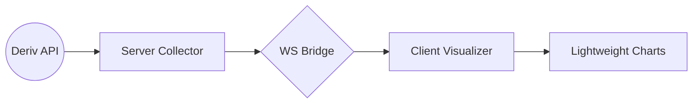

# Cipher Hybrid 3.0 Architecture

> [!IMPORTANT]
> This is a living document. All structural changes MUST be reflected here.

## System Overview

Cipher Hybrid 3.0 uses a **Server-Side Collector** and a **Client-Side Visualizer** connected via a high-speed WebSocket.

### Data Flow

## Server Components

| File | Purpose | Stateful? | EventEmitter? |
| :--- | :--- | :--- | :--- |
| `index.js` | Orchestrator, WS server, tick pipeline | Yes | Listener |
| `derivClient.js` | Deriv API WebSocket client with reconnection | Yes | Yes (tick, authorize, proposal_open_contract) |
| `tradingEngine.js` | Proposal/buy/settlement lifecycle | Yes | Yes (trade_outcome, contract_update) |
| `stateManager.js` | Global store, history | Yes | Internal only |
| `candleAggregator.js` | LWC-compatible OHLC generation | No | Result-only |
| `reachGridEngine.js` | Heatmap/grid computation | No | Result-only |
| `riskManager.js` | Stake limits, safety checks | Yes | No |
| `authController.js` | Token management | Yes | No |
| `server.js` | Fastify startup and routing | No | No |
| `logger.js` | Structured logging (Pino) | No | No |
| `db.js` | SQLite handle | Yes | No |
| `config.js` | Environment variables | No | No |

## Client Components

| File | Purpose |
| :--- | :--- |
| `core/App.js` | Root module. ChartSlot class, buffers, tab switching, barrier system, WS message routing |
| `utils/ChartHelpers.js` | DOM shortcuts, theme, candle config, coordinate math |
| `drawing/DrawingManager.js` | User annotations with shared RAF loop |
| `ui/TradeControls.js` | Stake, duration, barrier inputs |
| `ui/ModalManager.js` | Trade confirmation, settings |
| `ui/Sidebar.js` | Component lists, status indicators |
| `charts/PriceChart.js` | Lightweight Charts instance |
| `charts/GridOverlay.js` | Heatmap rendering layer |

## Known Gotchas

1. **LWC throws on unsorted/duplicate timestamps.** All data passed to `series.setData()` must be sorted ascending with unique `time` values. The `sanitizeCandleBar()` and `sanitizeTickPoint()` functions plus dedup logic in `ChartSlot.setData()` handle this.
2. **LWC v5 API differences.** Series are created with `chart.addSeries(LightweightCharts.CandlestickSeries, opts)` not `chart.addCandlestickSeries(opts)`. Markers use `createSeriesMarkers()` plugin.
3. **Deriv tick epochs can arrive out of order or duplicated.** `TickStore` rejects these with diagnostic logging. The `candleAggregator` handles gaps by filling flat candles.
4. **Grid panels vs normal tabs use different init patterns.** Grid panels use `rebuildGridPanel()` which destroys and recreates the series (needed for TF switching between line/candle types). Normal tabs use `ChartSlot.init()` which is one-time.
5. **Browser cache busting.** CSS and JS files use `?v=N` query params in `index.html`. Bump these after changes or the browser will serve stale files.
6. **Demo account token is hardcoded.** Token `dFRmBOxtictbZ7L` is in `config.js`. This is intentional — single-user demo account, no auth needed.
7. **The `isSwitching` lock on grid panels must be cleared synchronously.** Using `requestAnimationFrame` to clear it creates a window where incoming candles are silently dropped.

---

## Testing Strategy

- **Framework:** Jest (CommonJS, `npm test`)
- **Style:** Behavior-focused, concrete inputs/outputs, no mocking of our own code
- **Reference test:** `server/candleAggregator.test.js` — follow this pattern
- **Regression tests:** Every bug fix gets a test that would have caught it
- **Test locations:** `tests/` directory for integration tests, co-located `*.test.js` for unit tests

### Current test suites

| Suite | Tests | What it covers |
| :--- | :--- | :--- |
| `tests/core_logic.test.js` | 7 | VIEW/LIVE anchor logic, buffer hygiene, tick dedup/ordering |
| `server/candleAggregator.test.js` | 5 | Candle construction, boundary handling, gap-fill |
| `server/reachGridEngine.test.js` | 5 | Reach rate computation, incomplete window handling |
| `server/tradingEngine.test.js` | 3 | Buy flow, outcome normalization, barrier touch detection |

---

## Deployment & Versioning

| File | Current Version | Location |
| :--- | :--- | :--- |
| `style.css` | `?v=19` | `index.html` line 8 |
| `trading.css` | `?v=11` | `index.html` line 9 |
| `App.js` | `?v=55` | `index.html` line 421 |
| `TradeControls.js` | `?v=23` | `index.html` line 422 |
| `ChartHelpers.js` | `?v=12` | `index.html` line 423 |
| `derivClient.js` | `?v=31` | `server/index.js` line 4 |
| `tradingEngine.js` | `?v=27` | `server/index.js` line 5 |

### Last Audit: 2026-03-12
